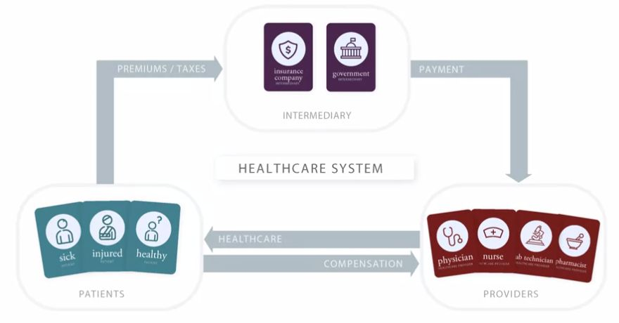
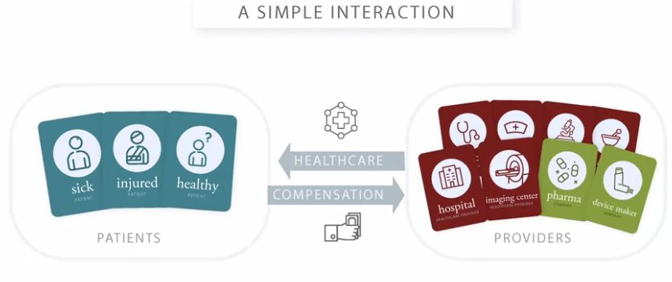

# AI in Healthcare Specialization (Coursera)

## Ai In Healthcare

### Introduction To Healthcare

#### Module 1

##### Overview And Key Challenges

Q: What is <b>risk pooling</b>?
<b>Answer</b>: 
The instructors define risk pooling as the spreading of financial risks across a large number&nbsp;

of contributors to a pool, so that the level of risk facing any one person is&nbsp;

reduced by combining risks across multiple people.&nbsp;

<b><i>Remarks</i></b>: 
The main idea is shifting the risk away from the individual, to the group, which can collectively better handle it.

Q: What is a <b>premium</b>?
<b>Answer</b>: It's the price charged for an insurance policy.

Q: Describe the different levels of care.
<b>Answer</b>: 
<ol><li><b>Primary care</b>: often the first point of entry for medical care; provided by primary care physicians (commonly outpatient setting)</li><li><b>Secondary care</b>: often referred by primary care; provided by specialists, e.g. cardiologists (outpatient and inpatient settings)</li><li><b>Tertiary care</b>: referred from secondary or primary care; usually provided by highly specialized physicians (mostly inpatient, sometimes outpatients settings)</li><li><b>Quaternary care</b>: most specialized care for rare and complex conditions (usually inpatient setting)</li></ol>

Q: How do the instructors define <b>risk</b>?
<b>Answer</b>: 
They define risk as the possibility of facing a financial loss associated with the use of healthcare.

Q: What are <b>insurance companies</b>?
<b>Answer</b>: <ul><li>The instructors define them as mainly private companies that have been set up to sell a product that we generally call health insurance.&nbsp;</li><li>By selling that product and running their business, they end up pooling risk.&nbsp;</li></ul>
<b><i>Remarks</i></b>: 
The product that these companies sell is something that we call an <b>insurance policy</b>.

Q: What are some of the access challenges of healthcare?
<b>Answer</b>: <ol><li>Lack of insurance coverage (e.g. in the US)</li><li>Socioeconomic disparities</li><li>Differing levels of education</li><li>Cultural issues</li><li>Language barriers</li><li>Lack of providers</li></ol>

Q: What does it mean when we say some physicians work in <b>inpatient settings</b>?
<b>Answer</b>: 
We usually mean healthcare provided to patients in hospitals.

<b><i>Remarks</i></b>: 
Patients needing inpatient care are admitted to the hospital, stay there for a period of time and receive care, and then go home when they're done.&nbsp;

Q: Describe the differing interests of patients, intermediaries and providers.
<b>Answer</b>: <ol><li><b>Patients</b>: Stay healthy and get needed medical care. </li><li><b>Intermediaries</b>: Manage healthcare risks, identify possible health issues, help patients get access to resources.</li><li><b>Providers</b>: Provide healthcare to patients, manage incoming information, assimilate data from colleagues and systems, better identify patients who need service.</li></ol>
<b><i>Remarks</i></b>: 
The lesson is: If you're thinking about where to develop tools for the healthcare system, make sure you're thinking specifically about who can use the tools and why they'd be motivated to use them.

Q: What are the three key challenges of health care systems?
<b>Answer</b>: <ol><li>The challenge of rising healthcare costs</li><li>The challenge of healthcare quality</li><li>The challenge of healthcare access</li></ol>

Q: Which four reasons for rising healthcare costs do the instructors list?
<b>Answer</b>: <ol><li>Populations getting older</li><li>Increase of populations' income and living standards.</li><li>Price increases (the amount of money we pay healthcare providers for any particular service)</li><li>Increases due to technological advances</li></ol>

Q: How do we call people who have an insurance policy?
<b>Answer</b>: They are called&nbsp;
<ol><li><b>enrollees</b></li><li><b>members</b></li><li><b>beneficiaries&nbsp;</b></li></ol>of the insurance policy. 

<b><i>Remarks</i></b>: 
When they have an insurance policy, we say that they're<b> covered</b>, or that they have coverage for&nbsp;

the medical care that's included in the policy.

Q: What are the two types of intermediaries?
<b>Answer</b>: <ol><li>Insurance companies</li><li>Government payers</li></ol>

Q: What are <b>intermediaries</b>?
<b>Answer</b>: The course instructors define intermediaries as entitities that collect funds from a group of people, pool the funds, and use them to pay for healthcare for the people who are covered.
<b><i>Remarks</i></b>: 
There are a couple of synonyms for intermediaries (with slight nuances of meanings), including <b>insurers,</b>&nbsp;<b>payers</b>, and (<b>health) plans</b>.&nbsp;

Q: Draw an updated version of the simple interaction between providers and patients, now including intermediaries.
<b>Answer</b>: 
 

Q: What does it mean when we say many physicians work in&nbsp;<b>outpatient settings</b>?
<b>Answer</b>: By outpatient setting, we generally mean outside of a hospital.
<b><i>Example</i></b>: For example, they may work in a physician office or a clinic (referred to as a <i>physician surgery</i> in some places).&nbsp;
<b><i>Remarks</i></b>: 
In outpatient care, patients come in, see a provider, get any consultation or treatment that they need and then go back home, generally all in the <i>same day</i>.&nbsp;

Q: What is a solution to the <b>problem of risk</b>?
<b>Answer</b>: <b>Risk pooling</b>

Q: What is an <b>insurance policy</b>?
<b>Answer</b>: 
The instructors define it as a contract that provides for paying the medical bills of the holder, usually under some conditions.&nbsp;

<b><i>Example</i></b>: 
Examples of conditions are:

<ul><li>It could be that you have to pay part of the cost yourself and the insurer will pay the rest.&nbsp;</li><li>It could be that costs are covered if you see providers that your insurance company has arrangements with but not other providers.&nbsp;</li></ul>

<b><i>Remarks</i></b>: 
It will generally say that if you have this insurance policy then your healthcare costs will be paid, maybe under some conditions, by the insurance company that sold you the policy.

Q: Draw an image of the simple interaction between providers and patients.
<b>Answer</b>: 

#### Module 2

##### Physician Practices And Physician Payments

Q: What are the three challenges for the quality of healthcare?
<b>Answer</b>: 
<ol><li>Underuse</li><li>Overuse</li><li>Misuse</li></ol>

<b><i>Example</i></b>: <ol><li><i>Underuse</i>: Variety of cases where beneficial, preventive care is not used as widely as it could be or perhaps should be.&nbsp;</li><li><i>Overuse</i>: Performing MRI scans for too many patients with low back pain.</li><li>
<i>Misuse</i>: Giving a patient a medication that interacted badly with another medicine the patient was taking, leading to problems maybe because someone wasn't keeping track well enough of&nbsp;

all the medications that a patient was taking.&nbsp; 
</li></ol>

Q: How do the instructors define <b>capitation </b>payment?
<b>Answer</b>: It is defined as payment per person, per unit of time.
<b><i>Remarks</i></b>: This can be seen as the opposite from <b>FFS</b> payment.

Q: Explain how capitation payments can lead to a shift of risk from the intermediary to the provider.
<b>Answer</b>: <ul><li>Capitation payment means that the provider is payed per patient and unit of time, irrespective of the number of services.</li><li>This means that, especially for solo practice and small physician groups, there is the risk that the fixed, prospective payments insufficiently cover the actually provided care.</li></ul>

Q: Which incentives are generated by capitation payment systems and what are associated risks?
<b>Answer</b>: <ul><li>Capitation creates the incentive to reduce the number of services and generally provide less care.</li><li>While this reduces the amount of unnecessary services, it increases the risk of <b>underuse</b>.</li></ul>

Q: Which incentives are generated by FFS payment systems and what are associated risks?
<b>Answer</b>: <ul><li>FFS creates incentives to increase the number of services and favor more expensive ones.</li><li>While this ensures that the patient gets what is needed, it creates the risk of <i>overuse</i>.</li></ul>

Q: What is <b>Fee for Service (FFS)</b> payment?
<b>Answer</b>: In this payment model, a doctor is paid for <i>each</i> service that she or he provides. 

Q: What is <b>Medicare</b>?
<b>Answer</b>: It is the US government payer that provides coverage for people mainly over the age of 65. 

