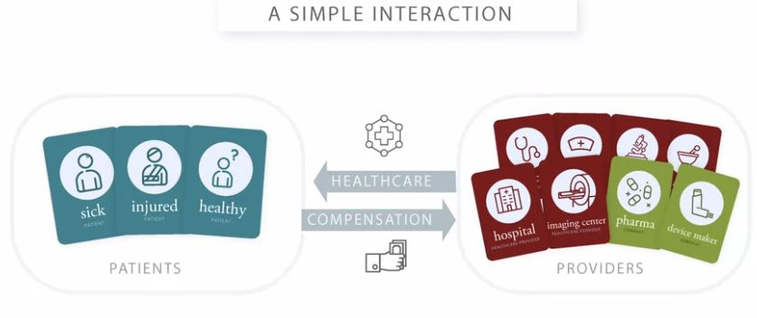

# AI in Healthcare Specialization - Introduction to Healthcare

## Ai In Healthcare

### Introduction To Healthcare

#### Module 1

##### Overview And Key Challenges

Q: Describe the differing interests of patients, intermediaries and providers.
<b>Answer</b>: <ol><li><b>Patients</b>: Stay healthy and get needed medical care. </li><li><b>Intermediaries</b>: Manage healthcare risks, identify possible health issues, help patients get access to resources.</li><li><b>Providers</b>: Provide healthcare to patients, manage incoming information, assimilate data from colleagues and systems, better identify patients who need service.</li></ol>

<b><i>Remarks</i></b>: 
The lesson is: If you're thinking about where to develop tools for the healthcare system, make sure you're thinking specifically about who can use the tools and why they'd be motivated to use them.

Q: What are the two types of intermediaries?
<b>Answer</b>: <ol><li>Insurance companies</li><li>Government payers</li></ol>

Q: How do we call people who have an insurance policy?
<b>Answer</b>: They are called&nbsp;
<ol><li><b>enrollees</b></li><li><b>members</b></li><li><b>beneficiaries&nbsp;</b></li></ol>of the insurance policy. 

<b><i>Remarks</i></b>: 
When they have an insurance policy, we say that they're<b> covered</b>, or that they have coverage for&nbsp;

the medical care that's included in the policy.

Q: What are the three key challenges of health care systems?
<b>Answer</b>: <ol><li>The challenge of rising healthcare costs</li><li>The challenge of healthcare quality</li><li>The challenge of healthcare access</li></ol>

Q: Which four reasons for rising healthcare costs do the instructors list?
<b>Answer</b>: <ol><li>Populations getting older</li><li>Increase of populations' income and living standards.</li><li>Price increases (the amount of money we pay healthcare providers for any particular service)</li><li>Increases due to technological advances</li></ol>

Q: Draw an updated version of the simple interaction between providers and patients, now including intermediaries.
<b>Answer</b>: 
 

Q: What are <b>intermediaries</b>?
<b>Answer</b>: The course instructors define intermediaries as entitities that collect funds from a group of people, pool the funds, and use them to pay for healthcare for the people who are covered.

<b><i>Remarks</i></b>: 
There are a couple of synonyms for intermediaries (with slight nuances of meanings), including <b>insurers,</b>&nbsp;<b>payers</b>, and (<b>health) plans</b>.&nbsp;

Q: What does it mean when we say many physicians work in&nbsp;<b>outpatient settings</b>?
<b>Answer</b>: By outpatient setting, we generally mean outside of a hospital.

<b><i>Example</i></b>: For example, they may work in a physician office or a clinic (referred to as a <i>physician surgery</i> in some places).&nbsp;

<b><i>Remarks</i></b>: 
In outpatient care, patients come in, see a provider, get any consultation or treatment that they need and then go back home, generally all in the <i>same day</i>.&nbsp;

Q: What is an <b>insurance policy</b>?
<b>Answer</b>: 
The instructors define it as a contract that provides for paying the medical bills of the holder, usually under some conditions.&nbsp;

<b><i>Example</i></b>: 
Examples of conditions are:

<ul><li>It could be that you have to pay part of the cost yourself and the insurer will pay the rest.&nbsp;</li><li>It could be that costs are covered if you see providers that your insurance company has arrangements with but not other providers.&nbsp;</li></ul>

<b><i>Remarks</i></b>: 
It will generally say that if you have this insurance policy then your healthcare costs will be paid, maybe under some conditions, by the insurance company that sold you the policy.

Q: Draw an image of the simple interaction between providers and patients.
<b>Answer</b>: 

Q: What is a solution to the <b>problem of risk</b>?
<b>Answer</b>: <b>Risk pooling</b>

Q: What is <b>risk pooling</b>?
<b>Answer</b>: The instructors define risk pooling as the spreading of financial risks across a large number of contributors to a pool, so that the level of risk facing any one person is reduced by combining risks across multiple people.

<b><i>Remarks</i></b>: 
The main idea is shifting the risk away from the individual, to the group, which can collectively better handle it.

Q: What is a <b>premium</b>?
<b>Answer</b>: It's the price charged for an insurance policy.

Q: How do the instructors define <b>risk</b>?
<b>Answer</b>: 
They define risk as the possibility of facing a financial loss associated with the use of healthcare.

Q: What are <b>insurance companies</b>?
<b>Answer</b>: <ul><li>The instructors define them as mainly private companies that have been set up to sell a product that we generally call health insurance.&nbsp;</li><li>By selling that product and running their business, they end up pooling risk.&nbsp;</li></ul>

<b><i>Remarks</i></b>: 
The product that these companies sell is something that we call an <b>insurance policy</b>.

Q: What are some of the access challenges of healthcare?
<b>Answer</b>: <ol><li>Lack of insurance coverage (e.g. in the US)</li><li>Socioeconomic disparities</li><li>Differing levels of education</li><li>Cultural issues</li><li>Language barriers</li><li>Lack of providers</li></ol>

Q: Describe the different levels of care.
<b>Answer</b>: 
<ol><li><b>Primary care</b>: often the first point of entry for medical care; provided by primary care physicians (commonly outpatient setting)</li><li><b>Secondary care</b>: often referred by primary care; provided by specialists, e.g. cardiologists (outpatient and inpatient settings)</li><li><b>Tertiary care</b>: referred from secondary or primary care; usually provided by highly specialized physicians (mostly inpatient, sometimes outpatients settings)</li><li><b>Quaternary care</b>: most specialized care for rare and complex conditions (usually inpatient setting)</li></ol>

Q: What does it mean when we say some physicians work in <b>inpatient settings</b>?
<b>Answer</b>: 
We usually mean healthcare provided to patients in hospitals.

<b><i>Remarks</i></b>: 
Patients needing inpatient care are admitted to the hospital, stay there for a period of time and receive care, and then go home when they're done.&nbsp;

#### Module 2

##### Physician Practices And Physician Payments

Q: Which incentives are generated by FFS payment systems and what are associated risks?
<b>Answer</b>: <ul><li>FFS creates incentives to increase the number of services and favor more expensive ones.</li><li>While this ensures that the patient gets what is needed, it creates the risk of <i>overuse</i>.</li></ul>

Q: What is <b>Medicare</b>?
<b>Answer</b>: It is the US government payer that provides coverage for people mainly over the age of 65. 

Q: Which incentives are generated by capitation payment systems and what are associated risks?
<b>Answer</b>: <ul><li>Capitation creates the incentive to reduce the number of services and generally provide less care.</li><li>While this reduces the amount of unnecessary services, it increases the risk of <b>underuse</b>.</li></ul>

Q: What is <b>Fee for Service (FFS)</b> payment?
<b>Answer</b>: In this payment model, a doctor is paid for <i>each</i> service that she or he provides. 

Q: Explain how capitation payments can lead to a shift of risk from the intermediary to the provider.
<b>Answer</b>: <ul><li>Capitation payment means that the provider is payed per patient and unit of time, irrespective of the number of services.</li><li>This means that, especially for solo practice and small physician groups, there is the risk that the fixed, prospective payments insufficiently cover the actually provided care.</li></ul>

Q: What are the three challenges for the quality of healthcare?
<b>Answer</b>: 
<ol><li>Underuse</li><li>Overuse</li><li>Misuse</li></ol>

<b><i>Example</i></b>: <ol><li><i>Underuse</i>: Variety of cases where beneficial, preventive care is not used as widely as it could be or perhaps should be.&nbsp;</li><li><i>Overuse</i>: Performing MRI scans for too many patients with low back pain.</li><li>
<i>Misuse</i>: Giving a patient a medication that interacted badly with another medicine the patient was taking, leading to problems maybe because someone wasn't keeping track well enough of&nbsp;

all the medications that a patient was taking.&nbsp; 
</li></ol>

Q: How do the instructors define <b>capitation </b>payment?
<b>Answer</b>: It is defined as a payment system in which a physician is payed a fixed amount per patient, per unit of time.

<b><i>Remarks</i></b>: This can be seen as the opposite from <b>FFS</b> payment.

#### Module 3

##### Hospitals And Payment Systems

Q: What is an <b>integrated delivery network</b> (<b>IDN</b>)?
<b>Answer</b>: It is an entity that owns, or closely integrates, many providers of different types to provide a broad range of care.

Q: What are <b>admitting privileges</b>?
<b>Answer</b>: These are arrangements for physicians to provide services at a hospital.

<b><i>Remarks</i></b>: In this case, physician practice and hospital are still separate businesses and probably paid separately.

Q: What is a <b>hospital network</b>?
<b>Answer</b>: It is a group of hospitals with whom an insurer works, and which enrollees are required or encouraged to use.

Q: What is the&nbsp;<b>global budget model</b>?
<b>Answer</b>: It is a payment system for inpatient care, where the hospital is paid a fixed amount for a period of time (often a year).

Q: What are <b>physician-hospital organizations</b> (<b>PHO</b>'s)?
<b>Answer</b>: These are larger organizations consisting of many hospitals that are part of the same company.

Q: What is <b>pay-for-performance</b> (<b>P4P</b>)?
<b>Answer</b>: It is the use of financial incentives or penalties based on whether or not a provider meets some set of performance expectations (focused on the quality of care).

Q: What is a <b>personal health record</b> (<b>PHR</b>)?
<b>Answer</b>: It commonly refers to an electronic application for patients to record their own personal health information.

<b><i>Remarks</i></b>: This may be for the patients' own use or to share with their healthcare providers.

Q: What are <b>Diagnosis-Related Groups</b> (<b>DRG</b>)?
<b>Answer</b>: It is a payment system where hospitals are paid a flat amount for each patient's hospital stay based on the given diagnosis.

Q: How can FFS, Per diem, DRG and Global budget systems be arranged according to the amount of risk transferred from intermediaries to hospitals?
<b>Answer</b>: They can be arranged from less risk to most risk transferred according to: <ol><li>Fee for service</li><li>Per diem</li><li>Diagnosis-related group</li><li>Global budget</li></ol>

Q: What are <b>hospital systems</b>?
<b>Answer</b>: These are larger organizations consisting of many hospitals that are part of the same company.

Q: How do we call large PHO's with a broader representation of physicians?
<b>Answer</b>: We then apply the term: <b>integrated delivery network</b> (<b>IDN</b>).

Q: What is an&nbsp;<b>Accountable Care Organization</b>&nbsp;(<b>ACO</b>)?
<b>Answer</b>: It is an organization that works to create <i>clinical integration (</i>providers work together to deliver integrated and coordinated patient care<i>)&nbsp;</i>across many providers. 

<b><i>Remarks</i></b>: Here, each provider or organization can voluntarily associate with the ACO, have some contractual arrangements, but stay in their own separate
organization.

Q: What is a <b>chargemaster </b>of a hospital?
<b>Answer</b>: It is a list of all the services that a hospital provides, and the amount that the hospital charges for each service.

Q: How does <b>per diem</b> payment work?
<b>Answer</b>: In a <b>per diem</b> payment system intermediaries pay a fixed amount to the hospital for each patient per day.

<b><i>Remarks</i></b>: This payment is a prospective payment since it does not regard the actual hospital's charges incurred for the provided services.

Q: What is a defining characteristic of a hospital?
<b>Answer</b>: The provision of beds and infrastructure for inpatient care.

Q: What are the two kinds of relationships between hospitals and physicians?
<b>Answer</b>: <ol><li>Hospitals may employ physicians directly.</li><li>A physician may have an arrangement to practice at the hospital, but still have a separate practice.</li></ol>

Q: Which are the four payment systems for hospitals?
<b>Answer</b>: <ol><li>Fee for service</li><li>Per diem</li><li>Diagnosis-related group</li><li>Global budget</li></ol>

Q: How can FFS, Per diem, DRG and Global budget systems be arranged according to incentives they create?
<b>Answer</b>: They can be arranged according to the incentive they create to provide care from <i>most </i>care to <i>least</i> care in the following way: <ol><li>Fee for service</li><li>Per diem</li><li>Diagnosis-related group</li><li>Global budget</li></ol>

<b><i>Remarks</i></b>: More care can lead to overuse, less care can lead to underuse!

Q: What is an <b>electrical medical record</b> (<b>EMR</b>)?
<b>Answer</b>: It is a digitized version of a patient's medical record.

Q: What are <b>hospitals</b>?
<b>Answer</b>: They are organizations that provide facilities and staff to offer medical care.

<b><i>Remarks</i></b>: They can operate as
private businesses, on a for-profit or a not-for-profit basis, and some hospitals are owned or operated by governmet organizations.

#### Module 4

##### Intermediaries And Health Care Financing

Q: What are the five tools that intermediaries can use to influence health care use and spending?
<b>Answer</b>: <ol><li><b>The management of provider availability and network</b>: deciding which providers to work with. </li><li><b>Provider Payment Methods and Levels: </b>defining the
structures governing payments to providers, in order to influence care use and costs. </li><li><b>Patient cost sharing</b>: used to influence care use and costs.</li><li><b>Utilization Review, Gatekeepers, and Other Methods of Directly Influencing Care</b>: a set of tools to directly control or manage utilization. </li><li><b>Coverage Decisions</b>: influence care use and costs by limiting the services the plan will cover.</li></ol>

Q: What is a <b>network provider panel</b>?
<b>Answer</b>: It is the set of providers organized by an intermediary to care for enrolled patients.

Q: What is <b>selective contracting</b>?
<b>Answer</b>: It is the selection of only a subset of providers into the intermediaries' network.

Q: How do <b>closed</b>, <b>open</b>, and <b>semi-open</b>/<b>semi-closed</b> panels differ from each other?
<b>Answer</b>: <ol><li>In a <b>closed panel</b>&nbsp;plan enrollees may only see providers in the panel, or else the intermediary won't contribute to the costs of care.</li><li>In an <b>open panel</b> plan the intermediary allows its members to go to any provider that they want.&nbsp;</li><li>In a <b>semi-open</b> or a <b>semi-closed</b> panel, enrollees are incentivized to go to providers in the network with maybe favorable cost-sharing, but the plan might still cover some of the cost if patients go outside the network.</li></ol>

Q: What are the three common health plan designs?
<b>Answer</b>: <ol><li><b>Traditional insurance or tradiational indemnity insurance</b>: this usually involves minimal use of the five tools.</li><li><b>Health maintenance organization</b> (<b>HMO</b>): the name stems from the intent to focus on prevention and maintenance of health, as opposed to traditional focus on treating people once they get sick and less on keeping them healthy.</li><li><b>Preferred provider organization</b> (<b>PPO</b>): its use of tools lies inbetween HMO and traditional insurance.</li></ol>

<b><i>Example</i></b>: <ol><li><b>Traditional</b>: Open panel, FFS, No gatekeepers, limited use of utilization review, often higher patient cost sharing.</li><li><b>HMO</b>: Defined network and closed panel, stronger provider payment incentives, commonly gatekeepers and utilization review, often less patient cost sharing.&nbsp;</li><li><b>PPO</b>: semi-open/semi-closed panel, moderate provider payment incentives, gatekeeper uncommon, some patient cost sharing.</li></ol>

Q: What is "managed care"?
<b>Answer</b>: A health plan design is defined as “managed care” if the intermediary aims to manage the
care of its enrollees through the use of the intermediary tools.&nbsp;

<b><i>Example</i></b>: Examples are HMOs and PPOs.

#### Module 5

##### Healthcare Products And Prescription Drugs

Q: Which are the two main groups of drugs?
<b>Answer</b>: <ol><li>Prescription drugs</li><li>Over-the-counter (OTC) drugs</li></ol>

<b><i>Remarks</i></b>: Prescription drugs require a prescription to obtain them, while over-the-counter drugs do not.

Q: Sketch the steps a prescription drug has to go through in order to get approval by the FDA.
<b>Answer</b>: <ol><li>The approval process is initiated by the drug company through filing an <b>investigational new drug application</b> (<b>IND</b>).</li><li>If the FDA approves, the drug company is allowed to test the drug in humans in a series of sucessive trials called <b>Phase I</b> (basic tests about drug safety; below 100 healthy&nbsp;subjects), <b>Phase II </b>(testing efficacy and side effects; 100-300 subjects with target condition), and <b>Phase III</b> (testing long-term side effects and compare to alternative therapies; 1000-3000 subjects with target condition).</li><li>If all three phases are successful, the drug company can file a<b> new drug application </b>(<b>NDA</b>), and if approved, can start marketing and selling the drug.</li></ol>

<b><i>Remarks</i></b>: It takes a long time for drug approvals; 9 years is a general estimate number and it can cost many millions or even billions of dollars.

Q: What is the difference between <i>branded </i>drugs and <i>generic </i>drugs?
<b>Answer</b>: <ol><li>“<b>Branded</b>” drugs are sold with patent protection by the manufacturer that first brings the drug to the market.</li><li>“<b>Generic</b>” drugs are sold by additional manufacturers after the primary manufacturer’s
patent expired. </li></ol>

<b><i>Remarks</i></b>: Branded drugs tend to be more expensive. When generic drugs enter the market, competition drives down the price.

Q: What's the <b>formulary</b>?
<b>Answer</b>: It is a list of drugs that a patient can buy and then get reimbursed for it.

Q: What can a&nbsp;<b>pharmacy</b> <b>benefit manager </b>(<b>PBM</b>) do?
<b>Answer</b>: <ol><li>Manage the design of prescription drug benefits (formularies or networks).</li><li>Manage payments to pharmacies.</li><li>Negotiate prices with pharmacies and negotiate rebates with manufacturers.</li></ol>

Q: What is a <b>pharmacy switch</b>?
<b>Answer</b>: It is a third-party vendor used by pharmacists to transmit claims from the pharmacy to the PBMs.

<b><i>Remarks</i></b>: <ul><li>They help the pharmacy determine all the rules about who pays what for what.&nbsp;</li><li>They can take the insurance information, figure out which PBM is handling the coverage for the patient, electronically get the info about cost-sharing or other rules from the PBM, and then turn around and send it back.</li></ul>

Q: What are the <b>six domains of quality</b>?
<b>Answer</b>: <ol><li>Safe
</li><li>Effective
</li><li>Patient-centered
</li><li>Timely
</li><li>Efficient
</li><li>Equitable</li></ol>

