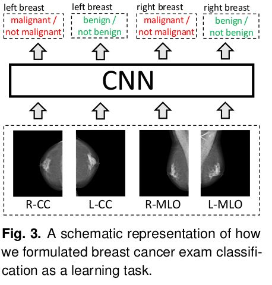
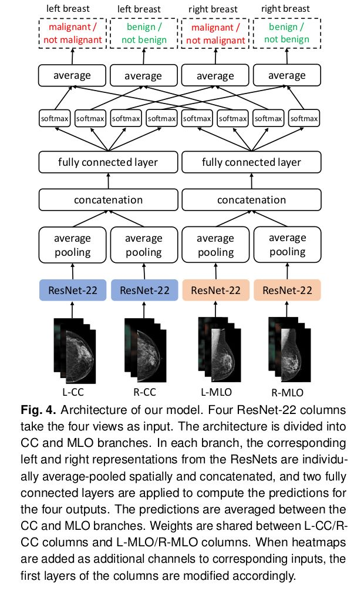

# Deep Neural Networks Improve Radiologists' Performance in Breast Cancer Screening

## Artificial Intelligence

### Health

#### Breast Cancer

Q: What are the contributions of the paper?
<b>Answer</b>: 
1)&nbsp;

<ul><li>Primarily, the authors train and evaluate a set of strong neural networks on a mammography dataset, with biopsy-proven labels, that is of a massive size by the standards of medical image analysis, let alone breast cancer screening.&nbsp;</li><li>They use two complimentary types of labels: breast-level labels indicating whether there is a benign or malignant finding in each breast, and pixel-level labels indicating the location of biopsied malignant and benign findings.&nbsp;</li><li>To quantify the value of pixel-level labels, they compare a model using only breast-level labels against a model using both breast-level and pixel-level labels.&nbsp;</li><li>The best model, trained on both breast-level and pixel-level labels, achieves an AUC of 0.895 in identifying malignant cases and 0.756 in identifying benign cases on a non-enriched test set reflecting the screening population.</li></ul>

2)&nbsp;

<ul><li>In the reader study, the authors compared their best model to that of radiologists and found their model to be as accurate as radiologists both in terms of area under ROC curve (AUC) and area under precision-recall curve (PRAUC).&nbsp;</li><li>&nbsp;They also found that a hybrid model, taking the average of the probabilities of malignancy predicted by a radiologist and by their neural network, yields more accurate predictions than either of the two separately.&nbsp;</li><li>&nbsp;This suggests that the network and radiologists learned different aspects of the task and that their model could be effective as a tool providing radiologists a second reader. </li></ul>

3)&nbsp;

<ul><li>Finally, the authors have made the code and weights of their best models available at https://github.com/nyukat/breast_cancer_classifier.&nbsp;</li><li>With this contribution, research groups that are working on improving screening mammography, which may not have access to a large training dataset like theirs, will be able to directly use the
model in their research or to use their pretrained weights as an initialization to train models with less data.&nbsp;</li><li>By making the models public, the authors invite other groups to validate the results and test the robustness to shifts in the data distribution.</li></ul>

Q: Provide the authors' problem definition for cancer classification.
<b>Answer</b>: <ul data-original-markdown="LSBGb3IgZWFjaCBicmVhc3QsIHRoZXkgYXNzaWduIHR3byBiaW5hcnkgbGFiZWxzOiB0aGUgYWJzZW5jZS9wcmVzZW5jZSBvZiBtYWxpZ25hbnQgZmluZGluZ3MgaW4gYSBicmVhc3QsIGFuZCB0aGUgYWJzZW5jZS9wcmVzZW5jZSBvZiBiZW5pZ24gZmluZGluZ3MgaW4gYSBicmVhc3QuIDxiciAvPi0gV2l0aCBsZWZ0IGFuZCByaWdodCBicmVhc3RzLCBlYWNoIGV4YW0gaGFzIGEgdG90YWwgb2YgZm91ciBiaW5hcnkgbGFiZWxzLiA8YnIgLz4tIFRoZSBnb2FsIG9mIHRoZSBhdXRob3JzIGlzIHRvIHByb2R1Y2UgZm91ciBwcmVkaWN0aW9ucyBjb3JyZXNwb25kaW5nIHRvIHRoZSBmb3VyIGxhYmVscyBmb3IgZWFjaCBleGFtLiA8YnIgLz4tIEFzIGlucHV0LCB0aGV5IHRha2UgZm91ciBoaWdoLXJlc29sdXRpb24gaW1hZ2VzIGNvcnJlc3BvbmRpbmcgdG8gdGhlIGZvdXIgc3RhbmRhcmQgc2NyZWVuaW5nPGJyIC8+bWFtbW9ncmFwaHkgdmlld3Mu">
<li>For each breast, they assign two binary labels: the absence/presence of malignant findings in a breast, and the absence/presence of benign findings in a breast. </li>
<li>With left and right breasts, each exam has a total of four binary labels. </li>
<li>The goal of the authors is to produce four predictions corresponding to the four labels for each exam. </li>
<li>As input, they take four high-resolution images corresponding to the four standard screening
mammography views.</li>
</ul>

<b><i>Example</i></b>: 
 

 

 

<b><i>Remarks</i></b>: 
The authors crop each image to a fixed size of 2677 × 1942 pixels for CC views and 2974 × 1748 pixels for MLO views.

Q: Provide the model architecture used for cancer classification.
<b>Answer</b>: <ul data-original-markdown="LSBUaGUgYXV0aG9ycyB0cmFpbmVkIGEgZGVlcCBtdWx0aS12aWV3IENOTiBvZiBhcmNoaXRlY3R1cmUgc2hvd24gaW4gdGhlIGZpZ3VyZSBiZWxvdyAoaW5zcGlyZWQgYnkgIkhpZ2gtcmVzb2x1dGlvbiBicmVhc3QgY2FuY2VyIHNjcmVlbmluZyB3aXRoIG11bHRpLXZpZXcgZGVlcCBjb252b2x1dGlvbmFsIG5ldXJhbCBuZXR3b3JrcyIuIGFyWGl2OjE3MDMuMDcwNDcpLjxiciAvPi0gVGhlIG92ZXJhbGwgbmV0d29yayBjb25zaXN0cyBvZiB0d28gY29yZSBtb2R1bGVzOiAoaSkgZm91ciB2aWV3LXNwZWNpZmljIGNvbHVtbnMsIGVhY2ggYmFzZWQgb24gdGhlIFJlc05ldCBhcmNoaXRlY3R1cmUgdGhhdCBvdXRwdXRzIGEgZml4ZWQtZGltZW5zaW9uIGhpZGRlbiByZXByZXNlbnRhdGlvbiBmb3IgZWFjaCBtYW1tb2dyYXBoeSB2aWV3LCBhbmQgKGlpKSB0d28gZnVsbHkgY29ubmVjdGVkIGxheWVycyB0byBtYXAgZnJvbSB0aGUgY29tcHV0ZWQgaGlkZGVuIHJlcHJlc2VudGF0aW9ucyB0byB0aGUgb3V0cHV0IHByZWRpY3Rpb25zLiA8YnIgLz4tIFRoZSBhdXRob3JzIHVzZWQgZm91ciBSZXNOZXQtMjIgY29sdW1ucyB0byBjb21wdXRlIGEgMjU2LWRpbWVuc2lvbiBoaWRkZW4gcmVwcmVzZW50YXRpb24gdmVjdG9yIG9mIGVhY2ggdmlldy48YnIgLz4tIFRoZSBjb2x1bW5zIGFwcGxpZWQgdG8gTC1DQy9SLUNDIHZpZXdzIHNoYXJlIHRoZWlyIHdlaWdodHMuIFRoZSBjb2x1bW5zIGFwcGxpZWQgdG8gTC1NTE8vUi1NTE8gdmlld3Mgc2hhcmUgdGhlaXIgd2VpZ2h0cyB0b28uIDxiciAvPi0gVGhlIGF1dGhvcnMgY29uY2F0ZW5hdGUgdGhlIEwtQ0MgYW5kIFItQ0MgcmVwcmVzZW50YXRpb25zIGludG8gYSA1MTItZGltZW5zaW9uIHZlY3RvciwgYW5kIGFwcGx5IHR3byBmdWxseSBjb25uZWN0ZWQgbGF5ZXJzIHRvIGdlbmVyYXRlIHByZWRpY3Rpb25zIGZvciB0aGUgZm91ciBvdXRwdXRzLiAgVGhleSBkbyB0aGUgc2FtZSBmb3IgdGhlIEwtTUxPIGFuZCBSLU1MTyB2aWV3cy48YnIgLz4tIFRoZXkgYXZlcmFnZSB0aGUgcHJvYmFiaWxpdGllcyBwcmVkaWN0ZWQgYnkgdGhlIENDIGFuZCBNTE8gYnJhbmNoZXMgb2YgdGhlIG1vZGVsIHRvIG9idGFpbiB0aGVpcjxiciAvPiAgZmluYWwgcHJlZGljdGlvbnMu">
<li>The authors trained a deep multi-view CNN of architecture shown in the figure below (inspired by "High-resolution breast cancer screening with multi-view deep convolutional neural networks", arXiv:1703.07047).</li>
<li>The overall network consists of two core modules: (i) four view-specific columns, each based on the ResNet architecture that outputs a fixed-dimension hidden representation for each mammography view, and (ii) two fully connected layers to map from the computed hidden representations to the output predictions. </li>
<li>The authors used four ResNet-22 columns to compute a 256-dimension hidden representation vector of each view.</li>
<li>The columns applied to L-CC/R-CC views share their weights. The columns applied to L-MLO/R-MLO views share their weights, too. </li>
<li>The authors concatenate the L-CC and R-CC representations into a 512-dimension vector, and apply two fully connected layers to generate predictions for the four outputs.  They do the same for the L-MLO and R-MLO views.</li>
<li>They average the probabilities predicted by the CC and MLO branches of the model to obtain their
  final predictions.</li>
</ul>

<b><i>Example</i></b>: 
 

 

 

<b><i>Remarks</i></b>: ResNet-22 refers to our version of a 22-layer ResNet, with additional modifications such as a larger kernel in the first convolutional layer.

Q: How did the authors evaluate their models?
<b>Answer</b>: <ul data-original-markdown="LSBUaGV5IGV2YWx1YXRlZCB0aGVpciBtb2RlbHMgcHJpbWFyaWx5IGluIHRlcm1zIG9mIEFVQyAoYXJlYSB1bmRlciB0aGUgUk9DIGN1cnZlKSBmb3IgbWFsaWduYW50L25vdCBtYWxpZ25hbnQgYW5kIGJlbmlnbi9ub3QgYmVuaWduIGNsYXNzaWZpY2F0aW9uIHRhc2tzIG9uIHRoZSBicmVhc3QgbGV2ZWwuIDxiciAvPi0gVGhlIG1vZGVsIGFuZCByZWFkZXJz4oCZIHJlc3BvbnNlcyBvbiB0aGUgc3Vic2V0IGZvciByZWFkZXIgc3R1ZHkgYXJlIGV2YWx1YXRlZCBpbiB0ZXJtcyBvZiBBVUMgYXMgd2VsbCBhcyBwcmVjaXNpb24tcmVjYWxsIEFVQyAoUFJBVUMpLCB3aGljaCBhcmUgY29tbW9ubHkgdXNlZCBtZXRyaWNzIGluIGV2YWx1YXRpb24gb2YgcmFkaW9sb2dpc3Rz4oCZIHBlcmZvcm1hbmNlLg==">
<li>They evaluated their models primarily in terms of AUC (area under the ROC curve) for malignant/not malignant and benign/not benign classification tasks on the breast level. </li>
<li>The model and readers’ responses on the subset for reader study are evaluated in terms of AUC as well as precision-recall AUC (PRAUC), which are commonly used metrics in evaluation of radiologists’ performance.</li>
</ul>

<b><i>Remarks</i></b>: <ul data-original-markdown="LSBST0MgYW5kIFBSQVVDIGNhcHR1cmUgZGlmZXJlbnQgYXNwZWN0cyBvZiBwZXJmb3JtYW5jZSBvZiBhIHByZWRpY3RpdmUgbW9kZWwuIDxiciAvPi0gVGhlIFJPQyBjdXJ2ZSBzdW1tYXJpemVzIHRoZSB0cmFkZW9mIGJldHdlZW4gdGhlIHRydWUgcG9zaXRpdmUgcmF0ZSBhbmQgZmFsc2UgcG9zaXRpdmUgcmF0ZSBmb3I8YnIgLz5hIG1vZGVsIHVzaW5nIGRpZmVyZW50IHByb2JhYmlsaXR5IHRocmVzaG9sZHMuIDxiciAvPi0gVGhlIHByZWNpc2lvbi1yZWNhbGwgY3VydmUgc3VtbWFyaXplcyB0aGUgdHJhZGUtb2YgYmV0d2VlbiB0aGUgdHJ1ZSBwb3NpdGl2ZSByYXRlIChyZWNhbGwpIGFuZCB0aGUgcG9zaXRpdmUgcHJlZGljdGl2ZSB2YWx1ZSAocHJlY2lzaW9uKSBmb3IgYSBtb2RlbCB1c2luZyBkaWZlcmVudCBwcm9iYWJpbGl0eSB0aHJlc2hvbGRzLg==">
<li>ROC and PRAUC capture diferent aspects of performance of a predictive model. </li>
<li>The ROC curve summarizes the tradeof between the true positive rate and false positive rate for
a model using diferent probability thresholds. </li>
<li>The precision-recall curve summarizes the trade-of between the true positive rate (recall) and the positive predictive value (precision) for a model using diferent probability thresholds.</li>
</ul>

Q: 
What is the <b>patch-level model </b>and why do the authors introduce it?

<b>Answer</b>: <ul data-original-markdown="LSBUaGUgaGlnaCByZXNvbHV0aW9uIG9mIHRoZSBpbWFnZXMgYW5kIHRoZSBsaW1pdGVkIG1lbW9yeSBvZiBtb2Rlcm4gR1BVcyBjb25zdHJhaW4gdGhlIGF1dGhvcnMgdG8gdXNlIHJlbGF0aXZlbHkgc2hhbGxvdyBSZXNOZXRzIHdpdGhpbiB0aGVpciBtb2RlbCB3aGVuIHVzaW5nIGZ1bGwtcmVzb2x1dGlvbiBpbWFnZXMgYXMgaW5wdXRzLiA8YnIgLz4tIFRvIGZ1cnRoZXIgdGFrZSBhZHZhbnRhZ2Ugb2YgdGhlIGZpbmUtZ3JhaW5lZCBkZXRhaWwgaW4gbWFtbW9ncmFtcywgdGhleSB0cmFpbmVkIGFuIGF1eGlsaWFyeSBtb2RlbCB0byBjbGFzc2lmeSAyNTYgw5cgMjU2LXBpeGVsIHBhdGNoZXMgb2YgbWFtbW9ncmFtcywgcHJlZGljdGluZyB0d28gbGFiZWxzOiB0aGUgcHJlc2VuY2Ugb3IgYWJzZW5jZSBvZiBtYWxpZ25hbnQgYW5kIGJlbmlnbiBmaW5kaW5ncyBpbiBhIGdpdmVuIHBhdGNoLiA8YnIgLz4tIFRoZSBsYWJlbHMgZm9yIHRoZXNlIHBhdGNoZXMgYXJlIHByb2R1Y2VkIGJhc2VkIG9uIHRoZSBwaXhlbC1sZXZlbCBzZWdtZW50YXRpb25zIG9mIHRoZSBjb3JyZXNwb25kaW5nIG1hbW1vZ3JhbXMgcHJvZHVjZWQgYnkgY2xpbmljaWFucy4gPGJyIC8+LSBUaGUgYXV0aG9ycyByZWZlciB0byB0aGlzIG1vZGVsIGFzIGEgKnBhdGNoLWxldmVsIG1vZGVsKiwgaW4gY29udHJhc3QgdG8gdGhlICpicmVhc3QtbGV2ZWwgbW9kZWwqIHdoaWNoIG9wZXJhdGVzIG9uIGltYWdlcyBvZiB0aGUgd2hvbGUgYnJlYXN0PGJyIC8+LSBUaGlzIGFwcHJvYWNoIGFsbG93cyB0byB1c2UgYSB2ZXJ5IGRlZXAgYXV4aWxpYXJ5IG5ldHdvcmsgYXQgdGhlIHBhdGNoIGxldmVsLCBhcyB0aGlzIG5ldHdvcmsgZG9lcyBub3QgaGF2ZSB0byBwcm9jZXNzIHRoZSBlbnRpcmUgaGlnaC1yZXNvbHV0aW9uIGltYWdlIGF0IG9uY2UuIDxiciAvPi0gQWRkaW5nIHRoZSBoZWF0bWFwcyBwcm9kdWNlZCBieSB0aGUgcGF0Y2gtbGV2ZWwgY2xhc3NpZmllciBhcyBhZGRpdGlvbmFsIGlucHV0IGNoYW5uZWxzIGFsbG93cyB0aGUgbWFpbiBjbGFzc2lmaWVyIHRvIGdldCB0aGUgYmVuZWZpdCBmcm9tIHBpeGVsLWxldmVsIGxhYmVscywgd2hpbGUgdGhlIGhlYXZ5IGNvbXB1dGF0aW9uIG5lY2Vzc2FyeSB0byBwcm9kdWNlIHRoZSBwaXhlbC1sZXZlbCBwcmVkaWN0aW9ucyBkb2VzIG5vdCBuZWVkIHRvIGJlIHJlcGVhdGVkIGVhY2ggdGltZSBhbiBleGFtcGxlIGlzIHVzZWQgZm9yIGxlYXJuaW5nLg==">
<li>The high resolution of the images and the limited memory of modern GPUs constrain the authors to use relatively shallow ResNets within their model when using full-resolution images as inputs. </li>
<li>To further take advantage of the fine-grained detail in mammograms, they trained an auxiliary model to classify 256 × 256-pixel patches of mammograms, predicting two labels: the presence or absence of malignant and benign findings in a given patch. </li>
<li>The labels for these patches are produced based on the pixel-level segmentations of the corresponding mammograms produced by clinicians.</li>
<li>This approach allows to use a very deep auxiliary network at the patch level, as this network does not have to process the entire high-resolution image at once. </li>
<li>Adding the heatmaps produced by the patch-level classifier as additional input channels allows the main classifier to get the benefit from pixel-level labels, while the heavy computation necessary to produce the pixel-level predictions does not need to be repeated each time an example is used for learning.</li>
</ul>

<b><i>Remarks</i></b>: The authors refer to this model as a&nbsp;<em>patch-level model</em>, in contrast to the&nbsp;<em>breast-level model</em>&nbsp;which operates on images of the whole breast. 

